## 🔐 Login Page

The Login Page provides a secure authentication interface for all users. Based on the assigned role (Administrator, Manager, or Employee), users are redirected to their respective dashboards after successful login. The page features a modern glassmorphism design with custom animations and an interactive user experience.

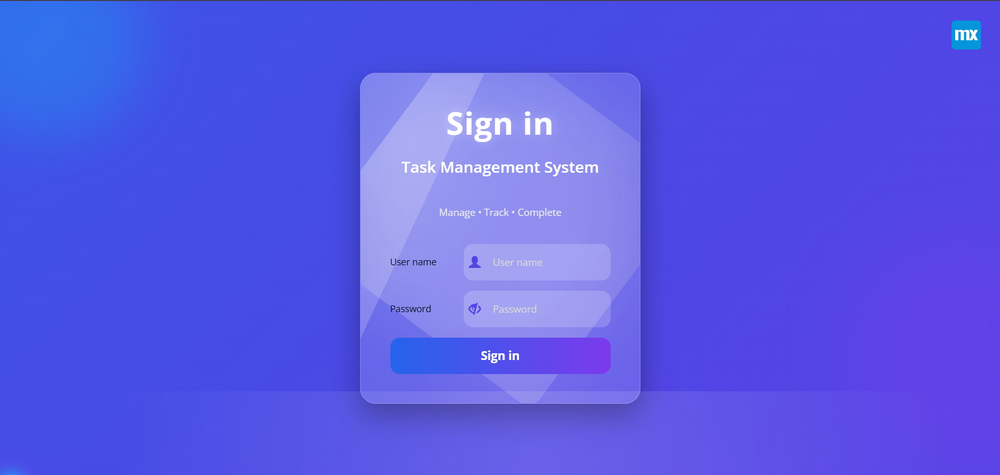

---

## 👨‍💼 Administrator Dashboard

The Administrator Dashboard serves as the central control panel for managing the application. It enables administrators to oversee the system, monitor activities, access important statistics, and navigate to user management and other administrative functions.

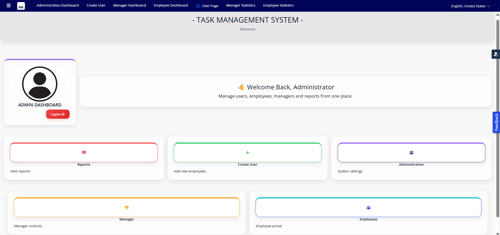

---

## 👤 Create User

The Create User page allows administrators to register new Manager and Employee accounts. User details such as name, username, password, email, department, and role can be configured to ensure secure role-based access.

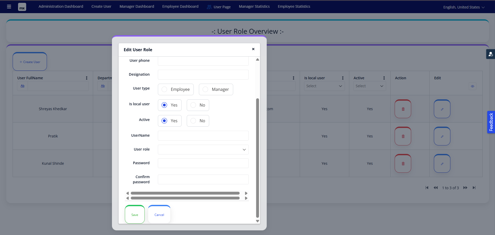

---

## 📋 Manager Dashboard

The Manager Dashboard provides an overview of task management activities. Managers can monitor employee progress, review task statuses, assign new tasks, and access dashboard statistics for better project management.

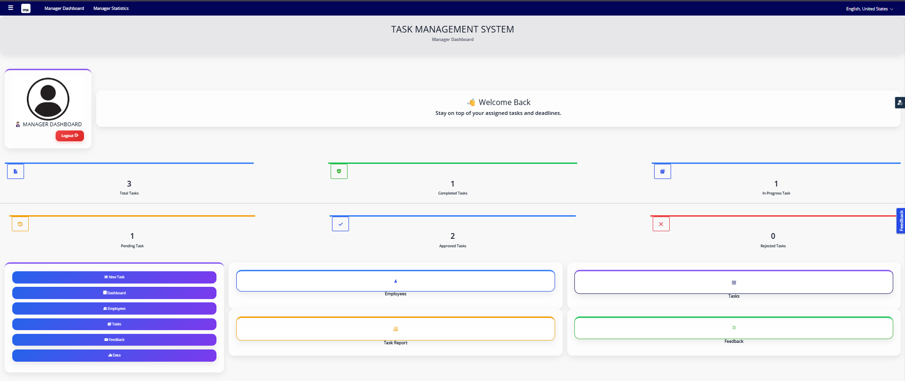

---

## 📝 Assign Task

The Assign Task page enables managers to create and assign tasks to employees. Managers can define the task title, description, priority level, deadline, and assign the task to the appropriate employee for execution.

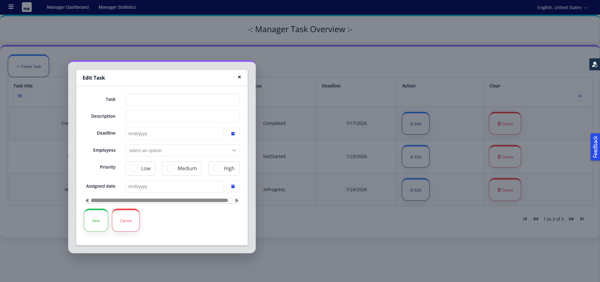

---

## 👩‍💻 Employee Dashboard

The Employee Dashboard provides employees with a personalized workspace where they can view assigned tasks, track deadlines, update task status, and access feedback provided by their managers.

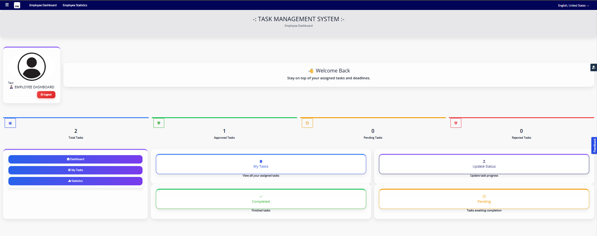

---

## 📋 My Tasks

The My Tasks page displays all tasks assigned to the logged-in employee. It provides complete task details, including priority, deadlines, current status, and progress, allowing employees to efficiently manage their daily responsibilities.

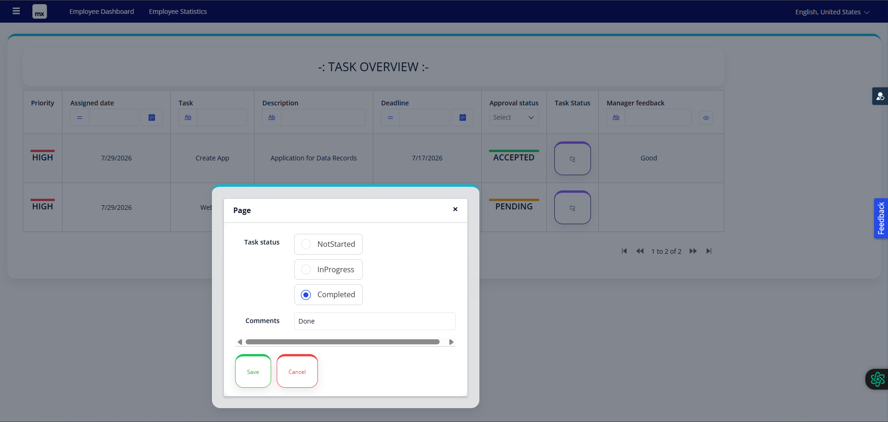

---

## 💬 Feedback

The Feedback page allows employees to view comments and suggestions provided by managers after reviewing completed tasks. It helps improve communication and supports continuous performance improvement.

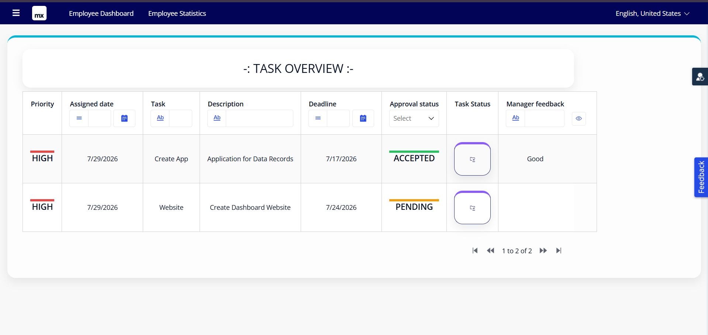

---

## 📊 Statistics Dashboard (Overview)

This dashboard presents a summary of important system metrics, including the total number of employees, total assigned tasks, completed tasks, pending tasks, approved tasks, and rejected tasks. It provides managers with a quick overview of overall project performance.

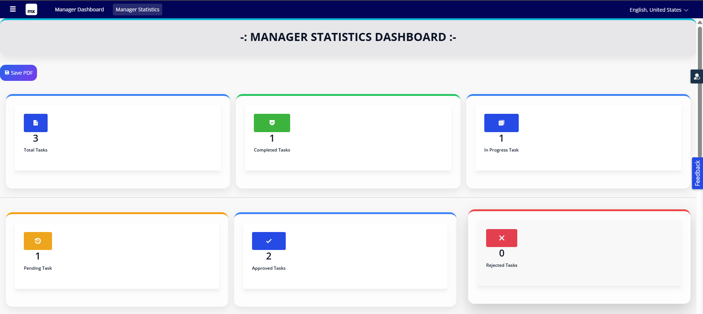

---

## 📈 Statistics Dashboard (Detailed View)

The detailed statistics dashboard provides additional insights into task progress, approval status, and employee performance. These visual indicators help managers make informed decisions and effectively monitor project activities.

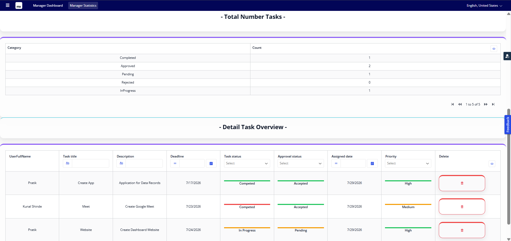

---

## ✅ Task Review

The Task Review page enables managers to evaluate completed tasks submitted by employees. Managers can verify task completion, approve or reject submissions, and provide constructive feedback before closing the task.

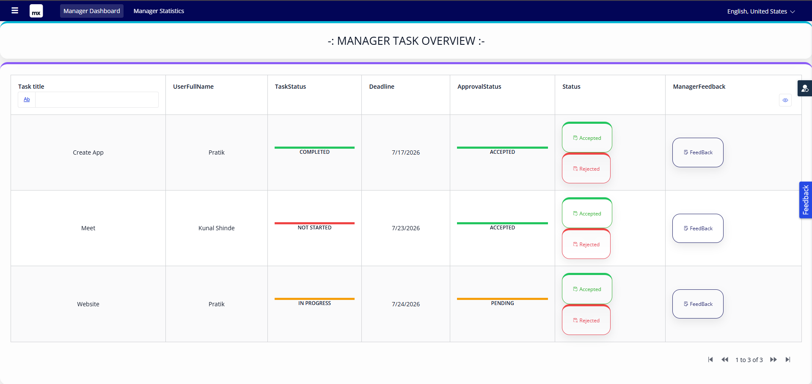

---

## 👥 User Management

The User Management page allows administrators to manage all user accounts within the application. Administrators can create, update, organize, and maintain Manager and Employee accounts while ensuring proper role assignments and secure access control.

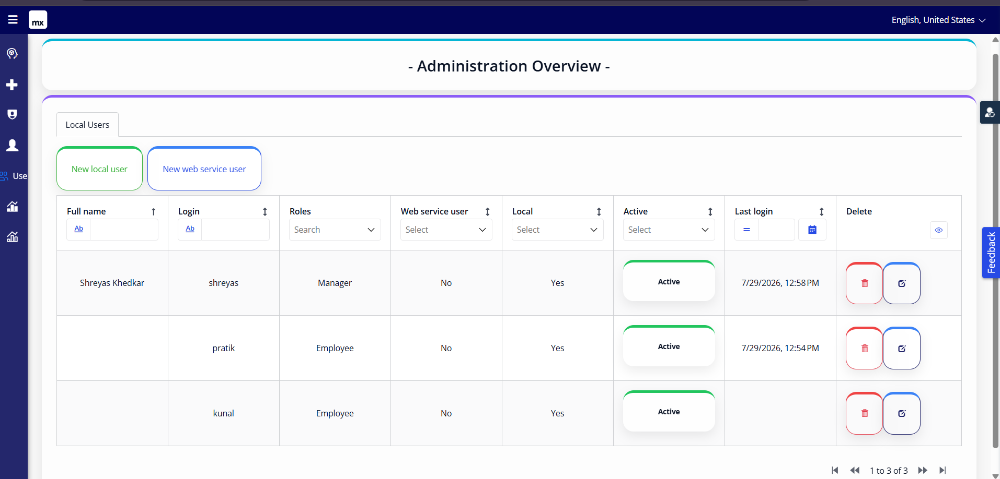
